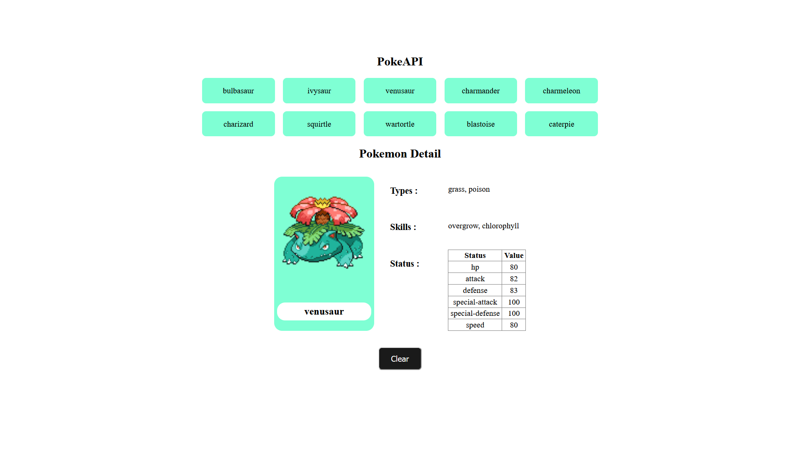

# PokeAPI React App

  

This is a simple React application that fetches and displays data from the PokeAPI. The app allows users to view a list of Pokémon and see detailed information about each selected Pokémon.

## Features

- Fetch and display a list of Pokémon from the PokeAPI.
- View detailed information about each Pokémon including its image, types, abilities, and stats.
- Clear the detailed view to select another Pokémon.

